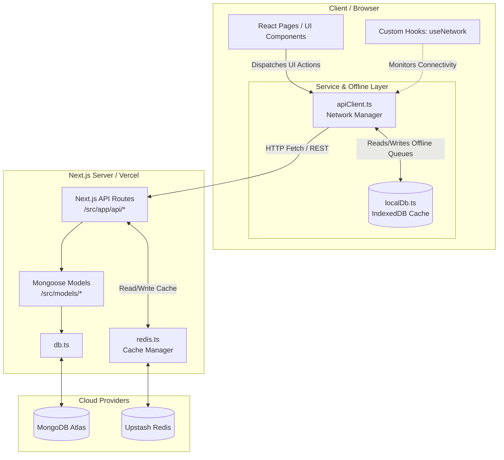

# Medishop Admin - Architecture Blueprint

## 1. Directory Structure

```text
medishop-admin/
├── src/
│   ├── app/                 # Next.js App Router: Contains all frontend pages and layout configurations.
│   │   ├── api/             # Backend API Routes: Next.js serverless functions handling business logic and DB access.
│   │   │   ├── auth/
│   │   │   ├── billing/
│   │   │   ├── inventory/
│   │   │   ├── purchases/
│   │   │   └── ...
│   │   ├── billing/         # POS & Billing page (Offline-first enabled)
│   │   ├── inventory/       # Core catalog and stock management UI
│   │   ├── purchases/       # PDF invoice parsing and auto-PO workflows
│   │   ├── settings/        # System configuration UI
│   │   └── ...
│   ├── components/          # Reusable React UI Components
│   │   ├── dashboard/       # Widgets for analytics and alerts
│   │   ├── layout/          # Global Sidebar, Topbar, and client-layout
│   │   └── ui/              # Base design system components (buttons, modals, etc.)
│   ├── hooks/               # Custom React Hooks
│   │   ├── useNetwork.ts    # Tracks online/offline status for PWA capabilities
│   │   └── use-debounce.ts  # Utility for handling rapid input searches
│   ├── lib/                 # Core Abstractions & Utilities
│   │   ├── apiClient.ts     # Global service layer managing HTTP requests and offline mutation queues
│   │   ├── localDb.ts       # IndexedDB manager for caching offline PWA data
│   │   ├── db.ts            # Mongoose MongoDB connection initialization
│   │   └── redis.ts         # Upstash Redis client for high-speed API caching
│   └── models/              # Mongoose Database Schemas
│       ├── Bill.ts          # Customer transactions and refunds
│       ├── Medicine.ts      # Master medicine catalog
│       ├── MedicineBatch.ts # Physical inventory stock levels and batches
│       ├── Patient.ts       # CRM patient records
│       ├── PurchaseInvoice.ts
│       └── Supplier.ts
├── public/                  # Static assets (images, manifest.json for PWA)
├── next.config.ts           # Next.js & Turbopack configuration
└── package.json             # Project dependencies and scripts
```

## 2. Data Flow & Dependency Architecture



## 3. Core Architectural Summaries

*   **`src/app`**: Acts as the central nervous system, housing both the React server/client UI pages and the backend serverless REST API endpoints.
*   **`src/components`**: Stores strictly presentational and reusable UI building blocks decoupled from deep business logic.
*   **`src/lib`**: Contains the critical offline-first architecture (`apiClient.ts` + `localDb.ts`) that intercepts network requests, manages local caching, and handles background synchronization.
*   **`src/models`**: Defines the strict NoSQL relational structures, separating master catalogs (`Medicine`) from physical stock tracking (`MedicineBatch`).
*   **`src/hooks`**: Provides reactive environmental awareness to components, such as detecting network drops to instantly toggle offline mode.
